# Loan Approval Classification Project

## Project Overview

This project predicts whether a loan will be approved (1) or not approved (0) using 4 key features:
- **CreditScore**
- **AnnualIncome**
- **EmploymentStatus**
- **TotalDebtToIncomeRatio**

It is a **binary classification task** using a **synthetic dataset** modeled after a Kaggle-style challenge.  
The dataset contains **20,000 rows**, and the target variable is `LoanApproved`.

---

## Step 1: Data Loading and Initial Exploration

First, the dataset was loaded and checked for completeness and structure.

- No missing values were found.
- A total of 20,000 samples and 5 columns were loaded.
- `EmploymentStatus` is categorical; others are numerical.
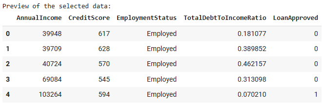
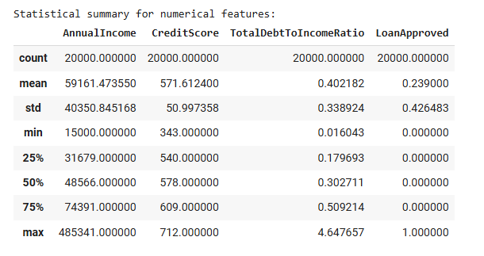

---

## Step 2: Feature Summary Table

I summarized each feature's type, value range, and potential outliers.  
This helped decide how to preprocess the features.

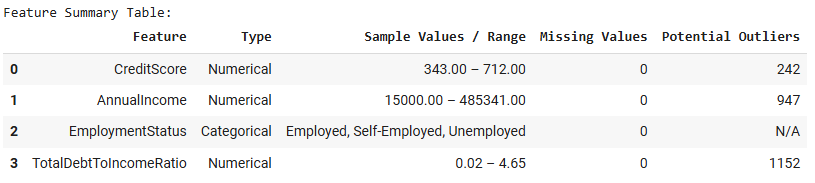

> EmploymentStatus is categorical (Employed, Self-Employed, Unemployed).  
> CreditScore, AnnualIncome, and DTI show significant outliers.

---

## Step 3: Feature Visualization by Loan Approval

This step compares how features differ between approved and not-approved loans.

- Approved loans tend to have higher credit scores and lower debt ratios.
- Employed applicants are approved more often.

**Credit Score by Approval Status**

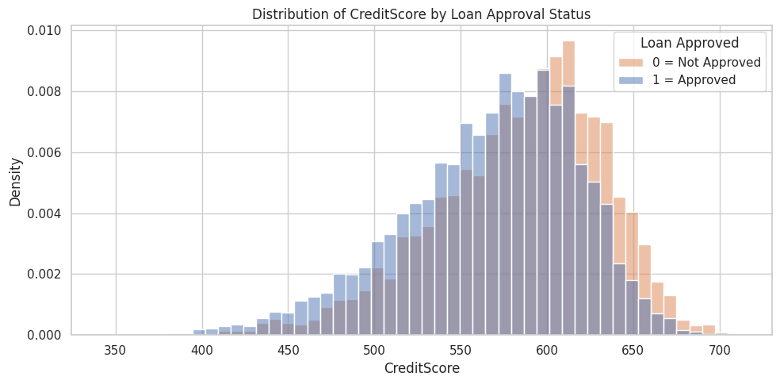

**Annual Income by Approval Status**

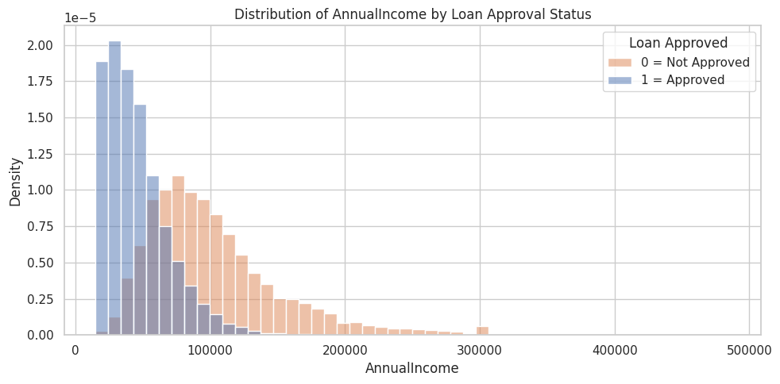

**Debt-to-Income Ratio by Approval Status**

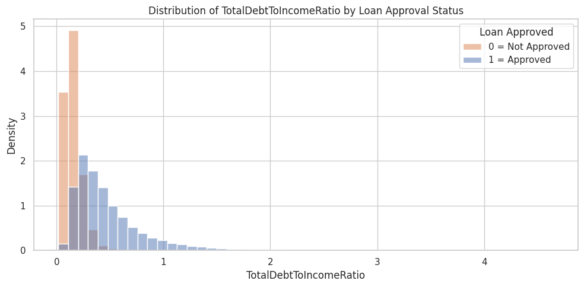

**Employment Status Distribution**

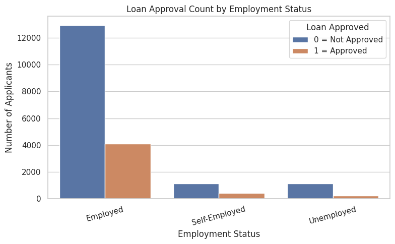

> These visual differences suggest that these features are useful for ML.

---

## Step 4: Data Cleaning and Preparation

- `EmploymentStatus` was one-hot encoded.
- The 3 numerical features were standardized using `StandardScaler`.
- Scaling ensures features are on a similar scale and avoids model bias.

**Credit Score: Before vs After Scaling**

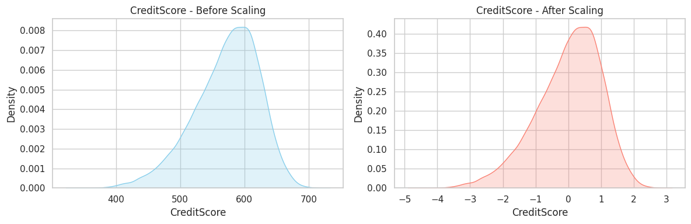

**Annual Income: Before vs After Scaling**

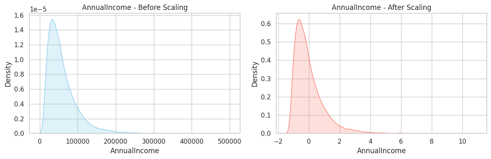

**Debt-to-Income Ratio: Before vs After Scaling**

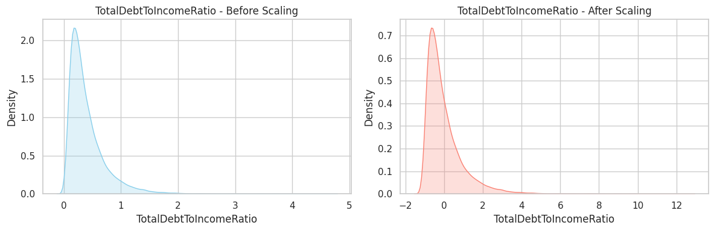

> Scaling normalized feature values around 0. The shape of each distribution is preserved.

---

## Step 5: Target Variable and Class Balance

The class distribution shows that the data is imbalanced:
- **LoanApproved = 0 (Not Approved): 76.1%**
- **LoanApproved = 1 (Approved): 23.9%**

> This imbalance makes **accuracy** less reliable; we also consider **F1-score**.

---

## Step 6: Model Training and Evaluation

We used a basic **Logistic Regression** model with an 80/20 train-test split.

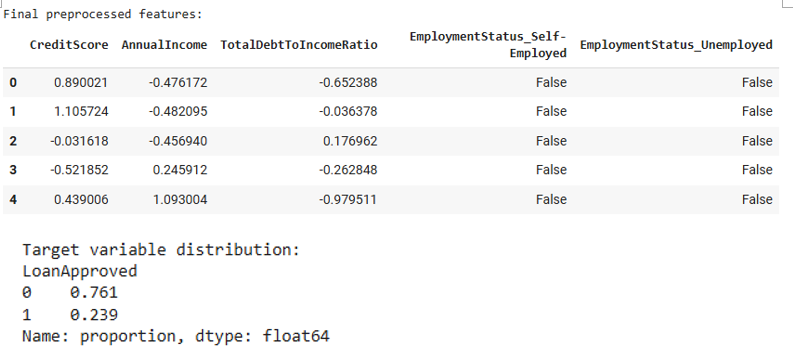

- **Accuracy:** 86.8%
- **F1-score (Approved class):** 0.70
- The confusion matrix shows good predictive ability, especially for rejections.

---

## Step 7: Submission File Creation

We created a submission file for the test set using the model’s predictions.

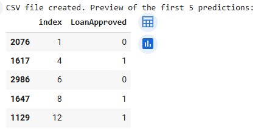

> The index may look shuffled due to the random train-test split,  
> but it correctly maps each prediction to the original data.

---

## Final Insight and Conclusion

This project followed the full machine learning process:
1. Problem definition  
2. Data loading and cleaning  
3. Feature visualization and selection  
4. Encoding and scaling  
5. Model training and evaluation  
6. Generating a valid prediction file

### Key insight:
- **CreditScore**, **EmploymentStatus**, and **Debt-to-Income Ratio** are strong predictors of loan approval.

This project helped me gain confidence in applying ML to real-world decisions and producing reliable outputs.

