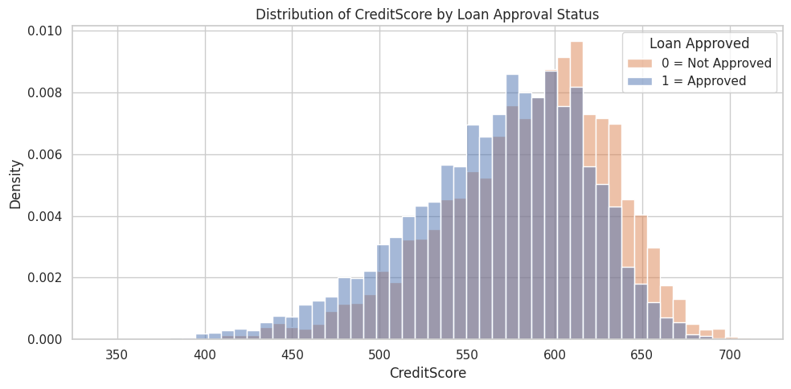
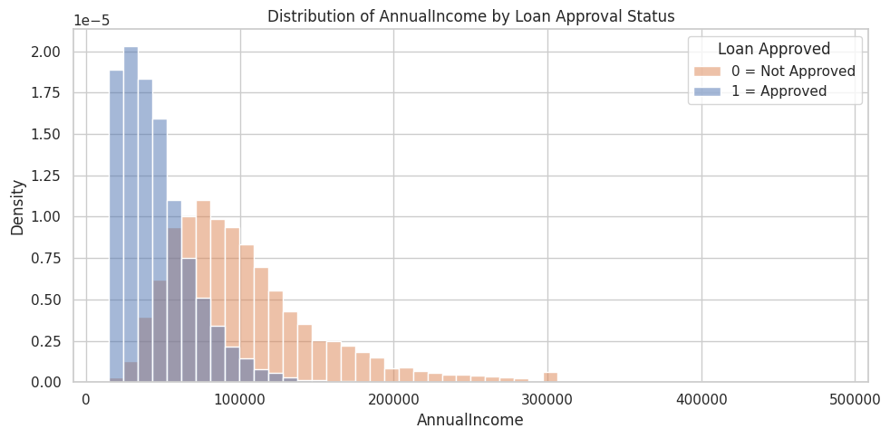
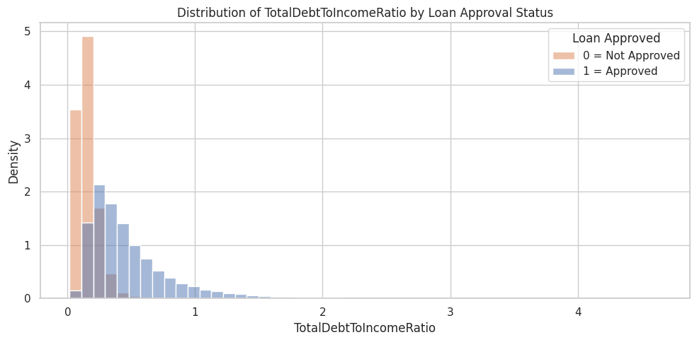
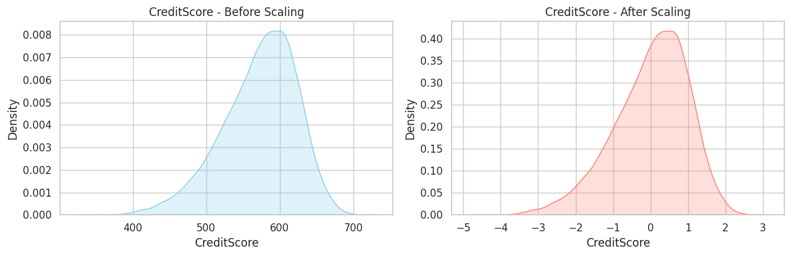
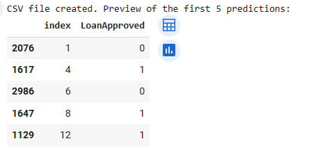

# Loan Approval Classification Project

## 📌 Overview
This project predicts whether a loan application will be approved using four key features:
- CreditScore
- AnnualIncome
- EmploymentStatus
- TotalDebtToIncomeRatio

The problem is binary classification with the target variable `LoanApproved` (0 = not approved, 1 = approved).  
The dataset is synthetic and contains 20,000 rows with no missing values.

---

## 📊 Step 1: Initial Data Exploration

---

## 📋 Step 2: Feature Summary

---

## 📈 Step 3: Feature Visualization by Loan Approval

**Credit Score Distribution**

**Annual Income Distribution**

**Debt-to-Income Ratio Distribution**

**Employment Status Bar Chart**

---

## ⚙️ Step 4: Feature Preparation and Scaling

**Scaled: Credit Score**

**Scaled: Annual Income**

**Scaled: Debt-to-Income Ratio**

---

## ⚠️ Step 5: Class Imbalance Check

- LoanApproved = 0 (Not Approved): 76.1%
- LoanApproved = 1 (Approved): 23.9%

---

## 🤖 Step 6: Model Training and Evaluation

- Model: Logistic Regression
- Accuracy: 86.8%
- F1-score (Approved): 0.70
- Confusion Matrix showed 606 correct approvals

---

## 📤 Step 7: Kaggle-style Submission File

The index values may look shuffled because the test set was randomly split,  
but each prediction correctly maps to its original test sample.

---

## ✅ Conclusion

This project helped me go through the entire machine learning pipeline:  
from defining the problem, exploring and visualizing the data, to building and evaluating a model.

A key insight was that **CreditScore**, **EmploymentStatus**, and **Debt-to-Income Ratio**  
were the strongest features affecting loan approval.

It was a valuable experience that made me more confident in solving real-world problems with data.
